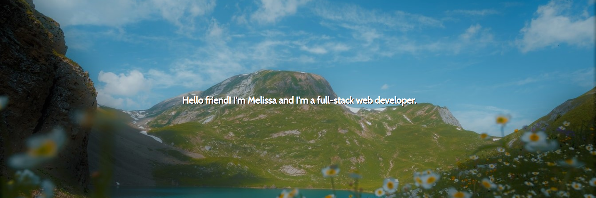

# Melissa Barrera's Portfolio 

## Description 
This portfolio was created to show off the skills I've learned while studying at the UC Berkely Extension's coding bootcamp! It is a SPA (single-page application) where you can learn a little about me, go over my resume, my portfolio, and a way to contact me. All created using React! 

Feel free to see it for yourself: 

[Click me to see Melissa's portfolio!](https://melissabarrerafarias.github.io/melissabarrera-portfolio/)

## Questions
 Github Username : melissabarrerafarias
  
  [Link to Github Profile](https://github.com/melissabarrerafarias)

  If you have any further questions or curiosities, feel free to contact me through email at melissabarrerafarias@gmail.com!